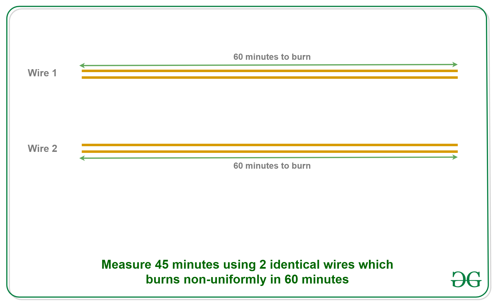
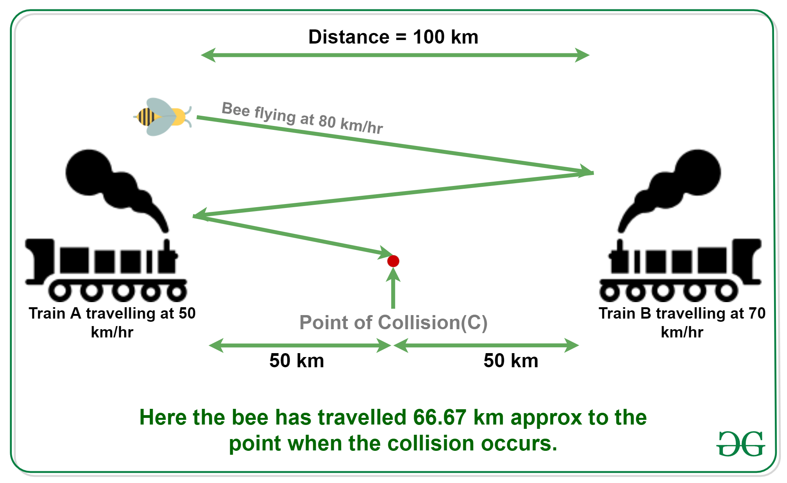

## Puzzles

### 1. Buring Wire

### 2. Ages of Daughter

Alok has three daughters. His friend Shyam wants to know the ages of his daughters. Alok gives him first hint.

1. The product of their ages is 72.
   Shyam says this is not enough information Alok gives him a second hint.
2. The sum of their ages is equal to my house number.
   Shyam goes out and look at the house number and tells “I still do not have enough information to determine the ages”.
   Alok admits that Shyam can not guess and gives him the third hint

3. The oldest of the girls likes strawberry ice-cream.

Shyam is able to guess after the third hint. Can you guess what are the ages of three daughters?

**Answer:**

1. Product of ages is 72
   Below are all possibilities to get 72 from product of three different ages:

1 _ 1 _ 72 = 72

1 _ 2 _ 36 = 72

1 _ 3 _ 24 = 72

1 _ 4 _ 18 = 72

1 _ 6 _ 12 = 72

1 _ 8 _ 9 = 72

2 _ 2 _ 18 = 72

2 _ 3 _ 12 = 72

2 _ 4 _ 9 = 72

2 _ 6 _ 6 = 72

3 _ 3 _ 8 = 72

3 _ 4 _ 6 = 72

2. Sum of the ages is given

1 + 1 + 72 = 74

1 + 2 + 36 = 39

1 + 3 + 24 = 28

1 + 4 + 18 = 23

1 + 6 + 12 = 19

1 + 8 + 9 = 18

2 + 2 + 18 = 22

2 + 3 + 12 = 17

2 + 4 + 9 = 15

2 + 6 + 6 = 14

3 + 3 + 8 = 14

3 + 4 + 6 = 13

All sums are unique except 14. So the age sum must have been 14, otherwise Shyam would have guessed the ages from hint 2 only.

So we have two possible combination to get sum 14

2 + 6 + 6 = 14

3 + 3 + 8 = 14

3. Alok has an oldest girl (not two!!). So the ages must be 3, 3 and 8.

### 3. Distance Trvaelled by Bee

**Answer**
Therfore, the total distance travelled by bee
= speed _ time
= 80 _ 100/(50+70)
= 66.67 km (approx)

### 4. 7 unit Rod

An employee works for an employer for 7 days. The employer has a gold rod of 7 units. How does the employer pay to the employee, so that the number of employee’s units increases by one at the end of each day. The employer can make at most 2 cuts in the rod.

**Solution:**
Employer can pay for seven days by making 2 cuts in a way that he has 3 rods of size 1, 2 and 4.

1st Day: Employer gives 1 unit cut.

2nd day: Takes back 1 unit cut from employee given on first day and gives 2 unit cut.

3rd Day: Gives 1 unit and then the employer is left with 4 unit rod lengths.

4th Day: Takes back cuts of 1 and 2 units. Gives the cut of 4 units.

5th Day: Gives cut of 1 unit.

6th Day: Takes back cut of 1 unit and gives cut of 2 units.

7th Day: Gives cut of 1 unit.

### 5. 3 Priests and 3 devils Puzzle

There are 3 devils and 3 Priests.They all have to cross a river in a boat.Boat can only carry two people at a time.As long as there are equal number of devils and priests,then devils will not eat Priest.If the number of devils are greater than the number of priests on the same side of the river then devils will eat the priests.So how can we make all the 6 peoples to arrive to the other side safely?

**Solution**
dddppp  
See Right side
1.ddppp dp d
2.dppp dd dd
3.ddp pp dp
4.ddd pp ppp

### 6. Find the fastest 3 horses

There are 25 horses among which you need to find out the fastest 3 horses. You can conduct race among at most 5 to find out their relative speed. At no point you can find out the actual speed of the horse in a race. Find out how many races are required to get the top 3 horses.

**solution:** 7.
